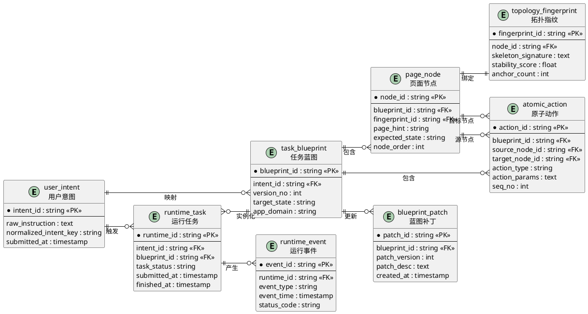
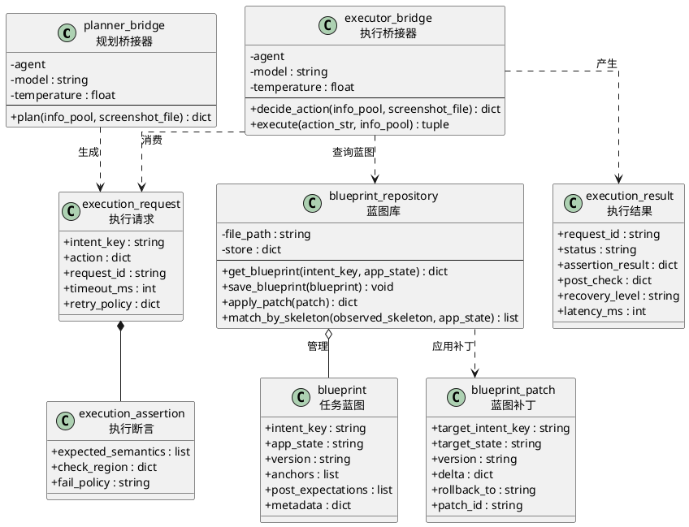
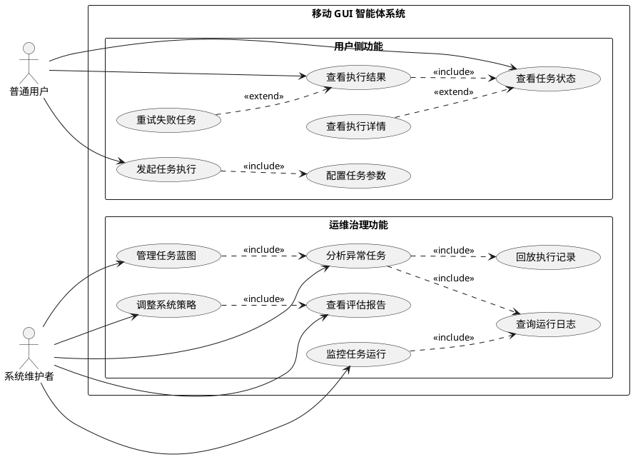

# 论文工程类图补充方案（PlantUML 版）

本文档面向当前版本的 [papertxt.txt](/mnt/d/ProjectSpace/Uni-Mind/PaperWorkSpace/papertxt.txt)，对工程类论文常见的三类图进行取舍分析，并输出建议保留图的 PlantUML 代码。

结合当前论文主线与评审关注点，最终建议如下：

1. **建议保留**
   - 系统逻辑数据模型与实体关系图
   - UML 用例图
2. **建议降级为可选附录**
   - UML 类图

目标不是把代码仓库全部画进论文，而是输出**评审能读懂、与正文一致、可直接生成**的图。

## 使用原则

1. 图中的对象必须与论文第 4 章和第 5 章术语一致。
2. 图的复杂度控制在评审可快速理解的范围内，不追求“全量还原代码”。
3. 关系表达要服务于论文主线，即：意图解析、页面感知、动作执行、蓝图复用。
4. PlantUML 更适合绘制“逻辑数据模型图”和 UML 图；若需严格 Chen 风格椭圆属性 E-R 图，可后续在 draw.io 中按本文件结构重绘。

---

## 一、最终取舍结论

### 1. 必要图

- **系统逻辑数据模型与实体关系图**
  插入位置：第 4 章 `4.4 数据库与知识库逻辑结构设计` 开头  
  原因：这张图和你的“任务蓝图、拓扑指纹、运行事件、蓝图补丁”直接绑定，是传统软件工程评审最容易接受的工程工作量证明。

- **系统主要用例图**
  插入位置：第 3 章 `3.2 系统功能需求定义` 前后  
  原因：这张图能快速说明“谁使用系统、能做什么”，适合帮助评审迅速建立系统边界认知。

### 2. 可选图

- **UML 类图**
  原因：类图更适合传统业务系统，不是你这篇论文的核心表达方式。若正文篇幅紧张，建议直接不放；若想增强“程序结构对应关系”，可作为附录或备选图保留。

### 3. 建议的插图顺序

1. 先补用例图
2. 再补系统逻辑数据模型与实体关系图
3. 类图仅在版面允许时再考虑

---

## 二、建议保留图 1：系统逻辑数据模型与实体关系图

### 1. 图名建议

建议不要直接命名为“系统 E-R 图”，更稳妥的写法是：

- `图4-x 系统逻辑数据模型与实体关系图`

这样既符合传统数据库设计口径，也避免被严格追问“是否是标准 Chen 风格 E-R 图”。

### 2. 建模说明

结合论文第 4.4 节与第 5.4 节，建议保留以下核心实体：

- `user_intent`：用户意图
- `task_blueprint`：任务蓝图
- `page_node`：页面节点
- `topology_fingerprint`：拓扑指纹
- `atomic_action`：原子动作
- `runtime_task`：运行任务
- `runtime_event`：运行事件
- `blueprint_patch`：蓝图补丁

其中：

- `task_blueprint` 是知识沉淀层的核心实体；
- `page_node` 用于承接论文中“蓝图是有向图，节点是页面状态或子任务状态”的表述；
- `atomic_action` 用于承接边上的动作迁移信息；
- `runtime_task` 与 `runtime_event` 体现系统运行态；
- `blueprint_patch` 体现热修复机制。

### 3. PlantUML 代码

### 4. 论文配套修改建议

建议在 `4.4 数据库与知识库逻辑结构设计` 开头增加一段说明：

> 为便于从传统软件工程视角理解本系统的数据组织方式，本文将知识沉淀层与运行态信息进一步抽象为逻辑数据模型，如图 4-x 所示。该模型以用户意图、任务蓝图、页面节点、拓扑指纹、原子动作、运行任务、运行事件和蓝图补丁为核心实体，刻画了任务从意图生成、蓝图实例化、动作执行到经验回灌的主要数据流转关系。

---

## 三、可选图：UML 类图（建议不进入正文）

### 1. 使用建议

如果论文正文已经具备：

- 系统总体架构图
- 逻辑数据模型图
- 关键流程图 / 时序图

则这张图可以直接省略。  
若后续你认为还需要再补一张“程序结构层面的图”，再考虑把它放到附录，而不是正文核心章节。

### 2. 建模说明

这张图不建议画成“全仓库类图”，否则评审无法阅读。  
建议仅保留最核心的运行时类与数据类，对应当前 `guiagent_v2` 的实际程序结构：

- `planner_bridge`：规划桥接器
- `executor_bridge`：执行桥接器
- `blueprint_repository`：蓝图库
- `execution_request`：执行请求
- `execution_assertion`：执行断言
- `execution_result`：执行结果
- `blueprint`：任务蓝图
- `blueprint_patch`：蓝图补丁

这样既能体现程序结构，也不会过于复杂。但需要强调：它对论文主结论的支撑弱于用例图和逻辑数据模型图。

### 3. PlantUML 代码

### 3. 处理建议

正文默认不插入。  
如需保留，建议放在附录，并在正文只简单说明“系统核心运行时类关系见附录图 A-x”。

---

## 四、建议保留图 2：UML 用例图

### 1. 图名建议

- `图3-x 系统主要用例图`

### 2. 建模说明

按照当前论文内容，用例图不应展开内部算法细节，而应突出系统的**角色边界、完整体验链路与治理职责**。  
相较于简单罗列功能，更合理的组织方式是将系统用例划分为两条主线：

- **普通用户任务闭环**：发起任务执行、跟踪状态、获取结果，并在失败时查看详情或重试任务；
- **系统维护者治理闭环**：监控运行情况、分析异常任务、管理任务蓝图、查看评估报告，并据此调整系统策略。

建议保留两个角色：

- `普通用户`
- `系统维护者`

建议保留的核心用例如下：

- 普通用户：发起任务执行、查看任务状态、查看执行结果、查看执行详情、重试失败任务
- 系统维护者：监控任务运行、查询运行日志、回放执行记录、分析异常任务、管理任务蓝图、查看评估报告、调整系统策略

关系梳理原则如下：

- `<<include>>` 表示必经子功能，例如“发起任务执行”必须包含“配置任务参数”；
- `<<extend>>` 表示条件性扩展功能，例如“重试失败任务”仅在执行失败时从“查看执行结果”扩展触发；
- 维护侧的“分析异常任务”应成为日志、回放与蓝图优化之间的枢纽，以体现治理链路，而不是将管理功能平铺罗列。

这张图适合放在需求分析章节，帮助评审快速理解系统边界，以及用户体验闭环与维护权限闭环。

### 3. PlantUML 代码

### 4. 论文配套修改建议

建议在 `3.2 系统功能需求定义` 开头增加如下说明：

> 从需求分析角度看，本系统不仅面向普通任务发起者，也面向负责系统治理与蓝图维护的运维人员。普通用户侧形成“发起任务、跟踪状态、查看结果、失败后扩展处理”的使用闭环；系统维护侧形成“监控运行、分析异常、维护蓝图、评估与调优”的治理闭环。基于上述角色划分与功能边界，可得到系统主要用例如图 3-x 所示。

---

## 五、图在论文中的修改建议

### 1. 第 3 章建议补充

在 `3.2 系统功能需求定义` 前后补：

- 图 3-x 系统主要用例图

对应作用：

- 让评审先看懂系统服务对象和主要功能边界；
- 避免第 3 章只有纯文字需求分析。

### 2. 第 4 章建议补充

在 `4.4 数据库与知识库逻辑结构设计` 前补：

- 图 4-x 系统逻辑数据模型与实体关系图

对应作用：

- 逻辑数据模型图负责说明“系统存什么、对象如何关联”。

### 3. 图名建议统一

建议统一采用以下命名口径：

- `图3-x 系统主要用例图`
- `图4-x 系统逻辑数据模型与实体关系图`

不要混用：

- “E-R 图”
- “数据库设计图”
- “类结构图”

否则全篇图名风格会不统一。

---

## 六、当前最推荐的执行顺序

1. 先补用例图  
   这是最容易通过评审快速理解的图。

2. 再补系统逻辑数据模型与实体关系图  
   这是传统软件工程论文最看重的“工作量证明”之一。

3. 类图暂缓  
   只有在你确认正文仍需一张“程序结构对应图”时，再考虑加入附录。

如果后续还需要，我可以继续补两类内容：

1. 直接生成适合 `draw.io` 二次编辑的更细化 PlantUML 版本  
2. 为这三张图分别补一段“可直接插入论文正文的图下注释与过渡段”
