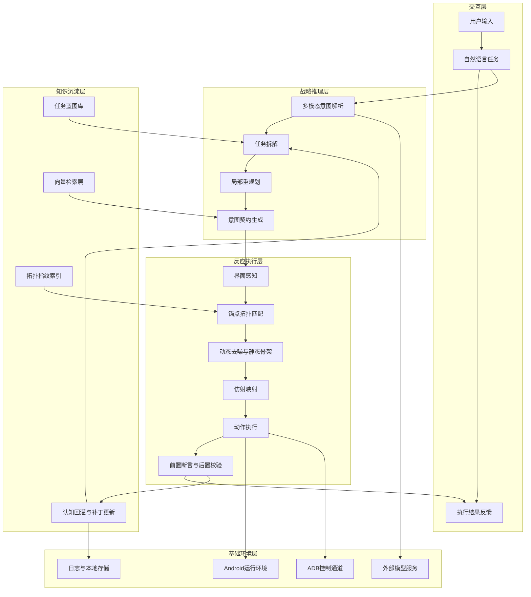
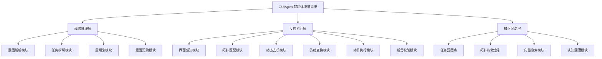
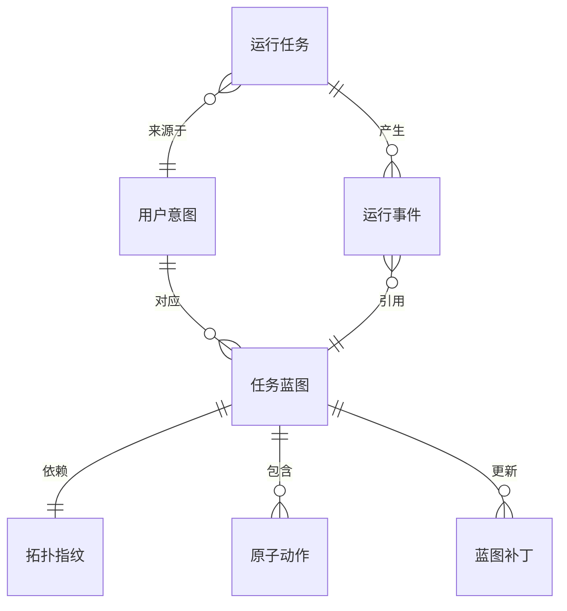
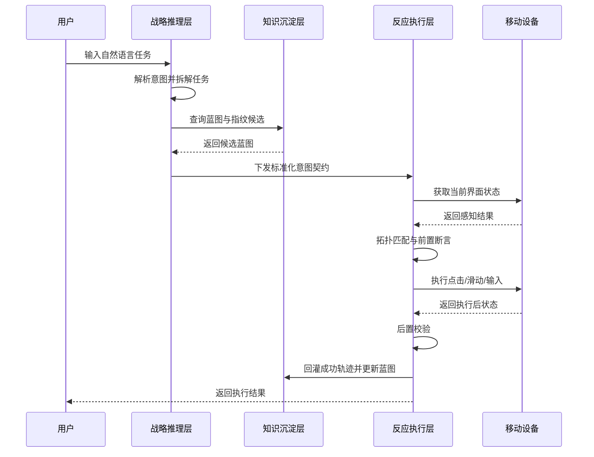
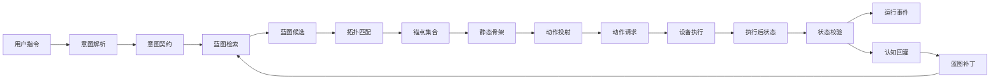
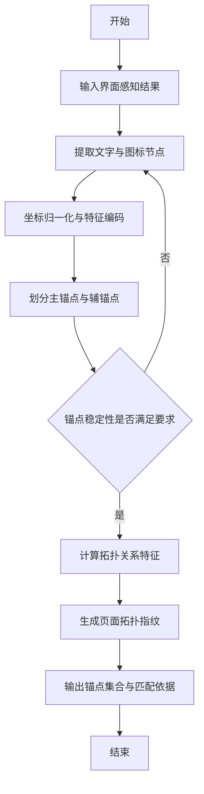
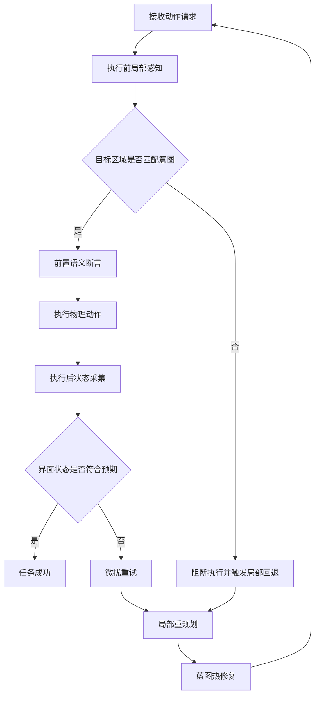
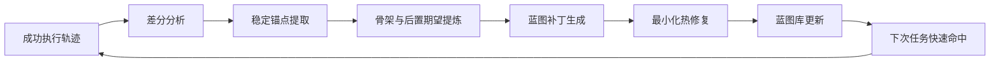
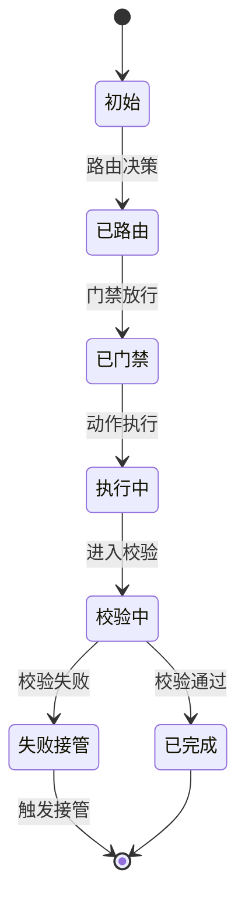
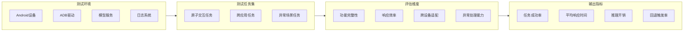

# 论文图表专业提示词模板库 v1

## 1. 文档目标

本文档用于为论文中的关键图表提供两类可直接使用的绘图输入：

1. `AI 生图 Prompt`
- 面向 Gemini / GPT-Image / 通用科研绘图模型
- 强调布局、区域、连线、颜色和图中中文标签

2. `Mermaid 图代码`
- 可直接在 Mermaid、draw.io 的 Mermaid 插件中使用
- 也可作为 Visio / ProcessOn / 亿图图示的结构草稿

说明：

- 所有图中的显示文本必须为中文。
- Prompt 可用英文或中文，但必须明确要求 `all visible labels in Chinese`。
- 图形风格以“学术论文、软件工程、结构清晰、矢量风格”为主。

## 2. 通用总提示词模板

这一段可作为所有论文图的总前缀。

```text
---BEGIN PROMPT---
[Style & Meta-Instructions]
High-fidelity academic schematic, software engineering thesis figure, clean white background, strict 2D vector style, crisp edges, no photorealism, no texture noise, no artistic abstraction. All visible labels, titles, captions, module names, arrows, annotations, and legends must be in Chinese only. Use a clean Chinese academic figure style suitable for undergraduate software engineering thesis defense and journal-style technical documentation.

[Typography Rules]
All on-figure text must be simplified Chinese. Use short Chinese labels, high readability, dark gray text, no English labels inside the figure. Keep labels aligned and evenly spaced.

[Color Rules]
Use low-saturation professional colors: blue-gray, teal, orange, green, and light purple as auxiliary. White background. Different modules should have distinct but restrained colors. Important paths use darker blue or orange arrows. Do not use neon colors.

[Layout Rules]
Strong modular boundaries, clear directional arrows, balanced spacing, no overcrowding, visually symmetric where appropriate. Use rounded rectangles for modules, database cylinders for storage, document icons for data objects, monitor/phone icons for device environment, gear icons for processing modules.

[Output Requirement]
Generate a thesis-ready technical figure. Do not draw decorative elements. Focus on software architecture clarity, data flow clarity, and Chinese academic annotation quality.
---END PROMPT---
```

## 3. 图 1：系统总体架构图

### 3.1 用途

- 对应第 4 章总体设计
- 这是最重要的“门面图”

### 3.2 推荐布局

- `Hierarchical Stack + Central Hub`
- 自上而下 5 层

### 3.3 AI 生图 Prompt

```text
---BEGIN PROMPT---
[Style & Meta-Instructions]
High-fidelity scientific schematic, software architecture diagram, clean white background, strict 2D vector design. All visible labels must be in Chinese only.

[LAYOUT CONFIGURATION]
Selected Layout: Hierarchical layered architecture with 5 horizontal layers
Composition Logic: Top-down architecture stack, each layer in a wide rounded rectangle, with vertical arrows showing control flow and side arrows showing feedback flow
Color Palette: Professional pastel blue, slate gray, mint green, warm orange

[ZONE 1: TOP - 交互层]
Container: A full-width top banner
Visual Structure: User icon on the left, document/task icon in the center, feedback icon on the right
Key Text Labels: "用户输入", "自然语言任务", "执行结果反馈"

[ZONE 2: UPPER-MIDDLE - 战略推理层]
Container: A wide rounded rectangle below Zone 1
Visual Structure: Four internal submodules connected left to right
Key Text Labels: "多模态意图解析", "任务拆解", "局部重规划", "意图契约生成"

[ZONE 3: CENTER - 反应执行层]
Container: The largest central processing layer
Visual Structure: Six internal modules arranged in two rows
Top row labels: "界面感知", "锚点拓扑匹配", "动态去噪与静态骨架"
Bottom row labels: "仿射映射", "动作执行", "前置断言与后置校验"

[ZONE 4: LOWER-MIDDLE - 知识沉淀层]
Container: A wide storage layer with database and document icons
Visual Structure: Four storage/process blocks
Key Text Labels: "任务蓝图库", "拓扑指纹索引", "向量检索层", "认知回灌与补丁更新"

[ZONE 5: BOTTOM - 基础环境层]
Container: Bottom infrastructure strip
Visual Structure: Four infrastructure blocks
Key Text Labels: "Android运行环境", "ADB控制通道", "外部模型服务", "日志与本地存储"

[CONNECTIONS]
1. Vertical solid arrows from "自然语言任务" down to "多模态意图解析"
2. Solid arrows inside strategic layer from left to right
3. Solid downward arrows from strategic layer to execution layer
4. Solid downward arrows from execution layer to device/infrastructure context
5. Curved feedback arrow from "认知回灌与补丁更新" back to "任务拆解" and "意图契约生成"
6. Side annotation arrow from execution layer to user feedback labeled "任务结果"

[SPECIAL REQUIREMENT]
The whole figure must look like a professional Chinese thesis architecture diagram. All labels must be Chinese, evenly aligned, concise, and readable.
---END PROMPT---
```

### 3.4 Mermaid 代码



## 4. 图 2：功能模块划分图

### 4.1 用途

- 对应第 4.2 节
- 强调模块工作量与分层职责

### 4.2 AI 生图 Prompt

```text
---BEGIN PROMPT---
[Style & Meta-Instructions]
Academic software module decomposition diagram, clean vector style, white background, all labels in Chinese only.

[LAYOUT CONFIGURATION]
Selected Layout: Hierarchical tree structure
Composition Logic: One root node at top, three major branches below, each branch expanded into 3 to 6 submodules
Color Palette: Blue for strategic layer, green for execution layer, orange for knowledge layer

[ZONE 1: ROOT]
Container: Top-centered rounded rectangle
Visual Structure: Single system root node
Key Text Labels: "智能体决策系统"

[ZONE 2: SECOND LEVEL]
Container: Three horizontally aligned large module nodes
Key Text Labels: "战略推理层", "反应执行层", "知识沉淀层"

[ZONE 3: THIRD LEVEL - 子模块]
Container: Small rounded rectangles below each major branch
Strategic labels: "意图解析模块", "任务拆解模块", "重规划模块", "意图契约模块"
Execution labels: "界面感知模块", "拓扑匹配模块", "动态去噪模块", "仿射变换模块", "动作执行模块", "断言校验模块"
Knowledge labels: "任务蓝图库", "拓扑指纹索引", "向量检索模块", "认知回灌模块"

[CONNECTIONS]
1. Straight solid arrows from root to three major branches
2. Straight solid arrows from each major branch to its submodules
3. No crossed edges, symmetric spacing, clean tree structure
---END PROMPT---
```

### 4.3 Mermaid 代码



## 5. 图 3：逻辑 E-R 图

### 5.1 用途

- 对应第 4.4 节
- 满足传统评审对数据库设计的期待

### 5.2 AI 生图 Prompt

```text
---BEGIN PROMPT---
[Style & Meta-Instructions]
Professional software engineering ER diagram, white background, vector style, all visible labels must be Chinese only.

[LAYOUT CONFIGURATION]
Selected Layout: Central relational schema
Composition Logic: Core entity in center, related entities distributed around it, crow-foot style or clear relationship lines
Color Palette: Neutral gray entities, blue highlights for core entity, orange for runtime entities

[ENTITIES]
Center entity: "任务蓝图"
Left entities: "用户意图", "原子动作"
Right entities: "拓扑指纹", "蓝图补丁"
Bottom entities: "运行任务", "运行事件"

[ENTITY FIELDS]
For each entity, show 3 to 5 key fields in smaller Chinese text
"用户意图": "意图主键", "原始指令", "标准意图键"
"任务蓝图": "蓝图主键", "意图键", "应用状态", "版本号"
"拓扑指纹": "指纹主键", "骨架签名", "稳定度"
"原子动作": "动作主键", "动作类型", "动作参数"
"运行任务": "运行主键", "任务状态", "提交时间"
"运行事件": "事件主键", "事件类型", "时间戳"
"蓝图补丁": "补丁主键", "目标蓝图", "补丁版本"

[RELATIONSHIPS]
1. "用户意图" one-to-many "任务蓝图"
2. "任务蓝图" one-to-one "拓扑指纹"
3. "任务蓝图" one-to-many "原子动作"
4. "任务蓝图" one-to-many "蓝图补丁"
5. "运行任务" one-to-many "运行事件"
6. "运行任务" many-to-one "用户意图"
7. "运行事件" many-to-one "任务蓝图"

[SPECIAL REQUIREMENT]
This must look like a thesis-ready logical data model figure, not a business ERP form. Keep all labels in Chinese.
---END PROMPT---
```

### 5.3 Mermaid 代码



## 6. 图 4：任务执行时序图

### 6.1 用途

- 对应第 4.3 节
- 展示完整业务闭环

### 6.2 AI 生图 Prompt

```text
---BEGIN PROMPT---
[Style & Meta-Instructions]
Sequence diagram in clean academic software engineering style, white background, vector lines, all labels in Chinese only.

[LAYOUT CONFIGURATION]
Selected Layout: Linear sequence diagram
Composition Logic: Five vertical lifelines from left to right
Color Palette: Dark gray lines, blue message arrows, orange feedback arrows

[PARTICIPANTS]
"用户"
"战略推理层"
"知识沉淀层"
"反应执行层"
"移动设备"

[MESSAGE FLOW]
1. 用户 to 战略推理层: "输入自然语言任务"
2. 战略推理层 self-call: "解析意图并拆解任务"
3. 战略推理层 to 知识沉淀层: "查询蓝图与指纹候选"
4. 知识沉淀层 to 战略推理层: "返回候选蓝图"
5. 战略推理层 to 反应执行层: "下发标准化意图契约"
6. 反应执行层 to 移动设备: "获取当前界面状态"
7. 移动设备 to 反应执行层: "返回感知结果"
8. 反应执行层 self-call: "拓扑匹配与前置断言"
9. 反应执行层 to 移动设备: "执行点击/滑动/输入"
10. 移动设备 to 反应执行层: "返回执行后状态"
11. 反应执行层 self-call: "后置校验"
12. 反应执行层 to 知识沉淀层: "回灌成功轨迹并更新蓝图"
13. 反应执行层 to 用户: "返回执行结果"

[SPECIAL REQUIREMENT]
Make the timing order extremely clear. Use Chinese labels only.
---END PROMPT---
```

### 6.3 Mermaid 代码



## 7. 图 5：数据流图

### 7.1 用途

- 对应第 4 章末尾或第 5 章前
- 突出“数据如何流转”

### 7.2 AI 生图 Prompt

```text
---BEGIN PROMPT---
[Style & Meta-Instructions]
Academic data flow diagram, clean 2D vector software thesis style, white background, all visible labels in Chinese only.

[LAYOUT CONFIGURATION]
Selected Layout: Left-to-right linear pipeline with feedback branch
Composition Logic: Input on left, processing in center, storage and feedback on right and lower-right
Color Palette: Blue for control semantics, green for perception data, orange for feedback/update path

[DATA OBJECTS]
"用户指令"
"意图契约"
"蓝图候选"
"锚点集合"
"静态骨架"
"动作请求"
"执行后状态"
"运行事件"
"蓝图补丁"

[PROCESS NODES]
"意图解析"
"蓝图检索"
"拓扑匹配"
"动作投射"
"设备执行"
"状态校验"
"认知回灌"

[CONNECTIONS]
1. 用户指令 -> 意图解析 -> 意图契约
2. 意图契约 -> 蓝图检索 -> 蓝图候选
3. 蓝图候选 -> 拓扑匹配 -> 锚点集合 -> 静态骨架
4. 静态骨架 -> 动作投射 -> 动作请求 -> 设备执行
5. 设备执行 -> 执行后状态 -> 状态校验
6. 状态校验 -> 运行事件
7. 状态校验 -> 认知回灌 -> 蓝图补丁
8. 蓝图补丁 feedback arrow back to 蓝图检索
---END PROMPT---
```

### 7.3 Mermaid 代码



## 8. 图 6：拓扑锚点识别算法流程图

### 8.1 用途

- 对应第 5.1.1 节

### 8.2 AI 生图 Prompt

```text
---BEGIN PROMPT---
[Style & Meta-Instructions]
Algorithm flowchart for thesis, clean vector style, all labels in Chinese only, white background.

[LAYOUT CONFIGURATION]
Selected Layout: Top-down algorithm flowchart
Composition Logic: Start at top, processing blocks in vertical sequence, one decision diamond in middle, output at bottom
Color Palette: Gray blocks, blue highlight for key algorithm steps, orange for decision node

[FLOW NODES]
"开始"
"输入界面感知结果"
"提取文字与图标节点"
"坐标归一化与特征编码"
"划分主锚点与辅锚点"
"计算拓扑关系特征"
"生成页面拓扑指纹"
"输出锚点集合与匹配依据"
"结束"

[DECISION NODE]
"锚点稳定性是否满足要求"

[FLOW LOGIC]
开始 -> 输入界面感知结果 -> 提取文字与图标节点 -> 坐标归一化与特征编码 -> 划分主锚点与辅锚点 -> 决策节点
If yes -> 计算拓扑关系特征 -> 生成页面拓扑指纹 -> 输出锚点集合与匹配依据 -> 结束
If no -> 返回“提取文字与图标节点”

[SPECIAL REQUIREMENT]
The decision diamond and loop-back arrow must be clear. Chinese labels only.
---END PROMPT---
```

### 8.3 Mermaid 代码



## 9. 图 7：闭环校验与异常自愈流程图

### 9.1 用途

- 对应第 5.3.2 节

### 9.2 AI 生图 Prompt

```text
---BEGIN PROMPT---
[Style & Meta-Instructions]
Clean academic flowchart for closed-loop validation and self-recovery, white background, vector style, all visible labels must be Chinese only.

[LAYOUT CONFIGURATION]
Selected Layout: Cyclic process with decision branches
Composition Logic: Main vertical process with two decision diamonds and one recovery loop on the side
Color Palette: Blue for normal path, orange for exception path, green for successful completion

[MAIN FLOW]
"接收动作请求"
"执行前局部感知"
"前置语义断言"
"执行物理动作"
"执行后状态采集"
"后置校验"
"任务成功"

[DECISION NODES]
"目标区域是否匹配意图"
"界面状态是否符合预期"

[RECOVERY NODES]
"阻断执行并触发局部回退"
"微扰重试"
"局部重规划"
"蓝图热修复"

[FLOW LOGIC]
接收动作请求 -> 执行前局部感知 -> 决策1
If yes -> 前置语义断言 -> 执行物理动作 -> 执行后状态采集 -> 决策2
If 决策2 yes -> 任务成功
If 决策2 no -> 微扰重试 -> 局部重规划 -> 蓝图热修复 -> 回到接收动作请求
If 决策1 no -> 阻断执行并触发局部回退 -> 局部重规划 -> 回到接收动作请求

[SPECIAL REQUIREMENT]
Make the recovery branch visually obvious. Use Chinese labels only.
---END PROMPT---
```

### 9.3 Mermaid 代码



## 10. 图 8：认知回灌与蓝图热修复图

### 10.1 用途

- 对应第 5.4.1 节

### 10.2 AI 生图 Prompt

```text
---BEGIN PROMPT---
[Style & Meta-Instructions]
Academic software feedback schematic, vector diagram, white background, all labels in Chinese only.

[LAYOUT CONFIGURATION]
Selected Layout: Cyclic iterative loop with 4 major nodes
Composition Logic: A clockwise circular process showing experience compilation into blueprint update
Color Palette: Blue-gray main cycle, orange highlight for repair/update node, green for success sample

[ZONE 1]
Container: Top node
Visual Structure: Successful runtime sample with check mark and event documents
Key Text Labels: "成功执行轨迹"

[ZONE 2]
Container: Right node
Visual Structure: Analysis engine with split document layers
Key Text Labels: "差分分析", "稳定锚点提取", "骨架与后置期望提炼"

[ZONE 3]
Container: Bottom node
Visual Structure: Patch and blueprint icons
Key Text Labels: "蓝图补丁生成", "最小化热修复"

[ZONE 4]
Container: Left node
Visual Structure: Blueprint repository cylinder and retrieval arrow
Key Text Labels: "蓝图库更新", "下次任务快速命中"

[CONNECTIONS]
1. Curved clockwise arrows connecting all four nodes
2. A small side note near the bottom: "从高成本推理到低成本复用"
3. Optional center label: "认知回灌闭环"

[SPECIAL REQUIREMENT]
This figure must emphasize iterative optimization and blueprint evolution. All text in Chinese.
---END PROMPT---
```

### 10.3 Mermaid 代码



## 11. 图 9：运行状态机图

### 11.1 用途

- 可放第 4 章或第 5 章
- 强化工程感

### 11.2 AI 生图 Prompt

```text
---BEGIN PROMPT---
[Style & Meta-Instructions]
Software runtime state machine diagram, thesis-ready vector style, white background, all labels in Chinese only.

[LAYOUT CONFIGURATION]
Selected Layout: State machine with directed transitions
Composition Logic: Horizontal or circular state progression with failure/handover branches
Color Palette: Gray default states, blue active states, green success state, red/orange failure and handover states

[STATES]
"初始"
"已路由"
"已门禁"
"执行中"
"校验中"
"已完成"
"失败接管"

[TRANSITIONS]
"路由决策"
"门禁放行"
"动作执行"
"进入校验"
"校验通过"
"校验失败"
"触发接管"

[SPECIAL REQUIREMENT]
Chinese only. Use rounded nodes and clear directional arrows. Make "失败接管" visually distinct.
---END PROMPT---
```

### 11.3 Mermaid 代码



## 12. 图 10：测试框架图

### 12.1 用途

- 对应第 6 章
- 让“测试不是拍脑袋”更清楚

### 12.2 AI 生图 Prompt

```text
---BEGIN PROMPT---
[Style & Meta-Instructions]
Academic testing framework diagram, software engineering vector style, white background, all visible labels in Chinese only.

[LAYOUT CONFIGURATION]
Selected Layout: Layered evaluation framework
Composition Logic: Test environment on left, test task set in center, evaluation dimensions on right, metrics at bottom
Color Palette: Blue-gray, teal, orange accents

[ZONE 1]
Key Text Labels: "测试环境", "Android设备", "ADB驱动", "模型服务", "日志系统"

[ZONE 2]
Key Text Labels: "测试任务集", "原子交互任务", "跨应用任务", "异常场景任务"

[ZONE 3]
Key Text Labels: "评估维度", "功能完整性", "响应效率", "跨设备适配", "异常处理能力"

[ZONE 4]
Key Text Labels: "输出指标", "任务成功率", "平均响应时间", "推理开销", "回退触发率"

[CONNECTIONS]
Environment -> Task Set -> Evaluation Dimensions -> Output Metrics

[SPECIAL REQUIREMENT]
The figure must look like a serious thesis testing framework overview, not a cartoon. Chinese only.
---END PROMPT---
```

### 12.3 Mermaid 代码



## 13. draw.io / Visio 使用建议

### 13.1 draw.io

推荐做法：

1. 先用本文 Mermaid 代码快速生成骨架。
2. 再手工替换为更美观的圆角矩形、数据库圆柱、设备图标。
3. 统一字体为中文黑体或思源黑体。
4. 统一线宽、箭头样式、圆角半径和配色。

### 13.2 Visio

推荐做法：

1. 按本文的 Zone 划分先摆框架。
2. 用基础形状库搭出结构，不要先纠结美化。
3. 最后统一：
- 标题字号
- 节点字号
- 模块颜色
- 箭头样式

## 14. 最终建议

如果时间有限，优先把以下 5 张图做出来：

1. 系统总体架构图
2. 功能模块划分图
3. 逻辑 E-R 图
4. 任务执行时序图
5. 闭环校验与异常自愈流程图

这 5 张最能直接提升评审印象，也最能支撑你的第 4 章和第 5 章。
