# 论文图表结构化代码包 v1

## 1. 文档用途

本文档提供更适合 `draw.io / Mermaid` 使用的结构化代码，重点覆盖以下 4 张图：

1. `图4-3 智能体任务执行全生命周期时序图`
2. `图4-4 系统逻辑数据模型与实体关系图`
3. `图5-3 闭环校验与异常自愈流程图`
4. `图5-4 认知回灌与蓝图热修复流程图`

使用建议：

1. `draw.io`
- 打开 `插入 -> 高级 -> Mermaid`
- 直接粘贴下面代码
- 如果某类图在 draw.io 中渲染不稳定，优先使用文中给出的 `兼容版 flowchart`

2. `Mermaid Live Editor`
- 先在 Mermaid 中预览
- 再导入到 draw.io 或截图后手工复刻

3. `论文终稿`
- Mermaid 适合出草图与结构图
- 最终版本建议在 draw.io 中统一字体、对齐和颜色后导出

## 2. 图4-3 智能体任务执行全生命周期时序图

说明：

- 原始的 `图4-3` 如果把成功路径、蓝图命中/未命中分支、前后置校验、异常回退、回灌更新全部放进一张图，会比较拥挤。
- 更适合论文正文的做法是拆成两张配套图：
  1. `图4-3(a) 主成功链路时序图`
  2. `图4-3(b) 异常回退与重规划时序图`
- 正文中仍可统一称为“图4-3”，子图分别标注 `(a)` 与 `(b)`。

### 2.1 推荐用途

- 第 4.3 节正文插图
- 重点体现：输入、检索、执行、校验、回灌、反馈

### 2.2 图4-3(a) 主成功链路时序图

这张图只保留“正常执行成功”的主链路，用于说明系统的标准任务处理流程。

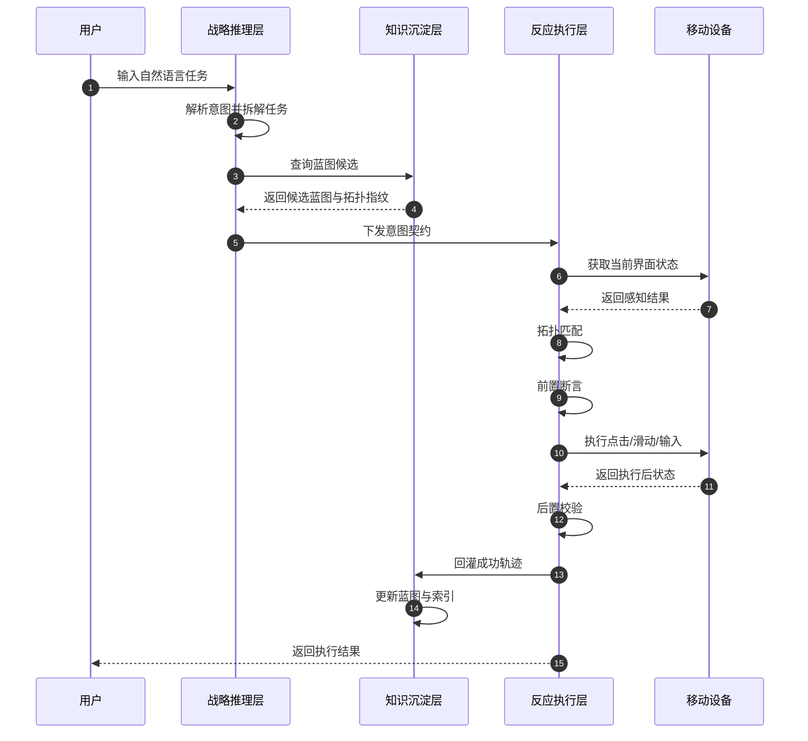

### 2.3 图4-3(b) 异常回退与重规划时序图

这张图专门用于说明：

1. 前置断言失败
2. 后置校验失败
3. 反馈回推理层重规划

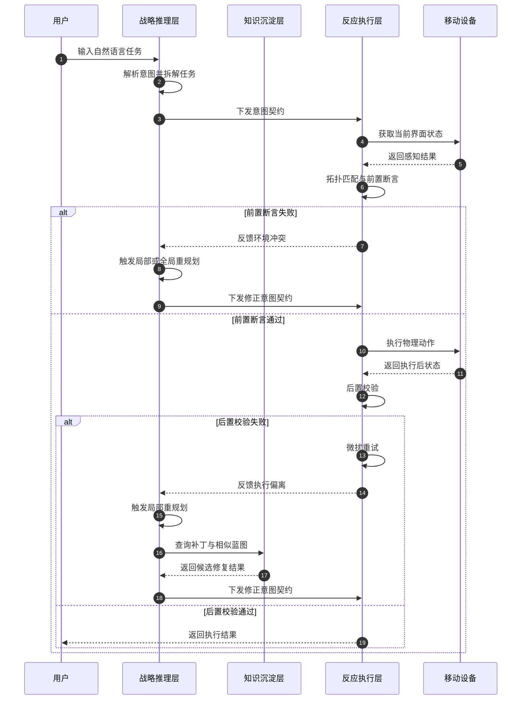

### 2.4 图4-3(c) 全量标准版

如果你后面仍然想保留“一张大图总览版”，可以继续用下面这一版，但正文里更建议拆分展示。

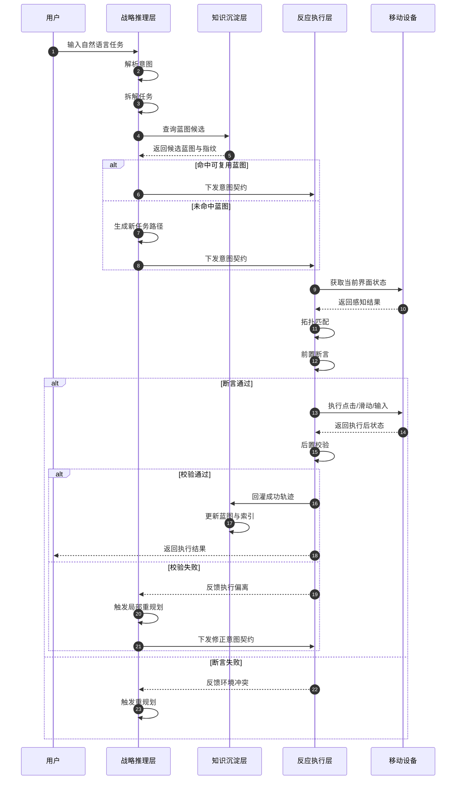

### 2.5 draw.io 兼容说明

这一版适合直接导入 draw.io。  
但用于论文时，更推荐直接使用上面的 `(a)` 与 `(b)` 两张拆分图。

## 3. 图4-4 系统逻辑数据模型与实体关系图

### 3.1 推荐用途

- 第 4.4 节正文插图
- 目标是让传统软件工程评审快速理解“实体、字段、关系”

### 3.2 Mermaid 类图版

说明：
- `classDiagram` 比 `erDiagram` 更适合表达字段
- 这版更适合作为论文逻辑数据模型图

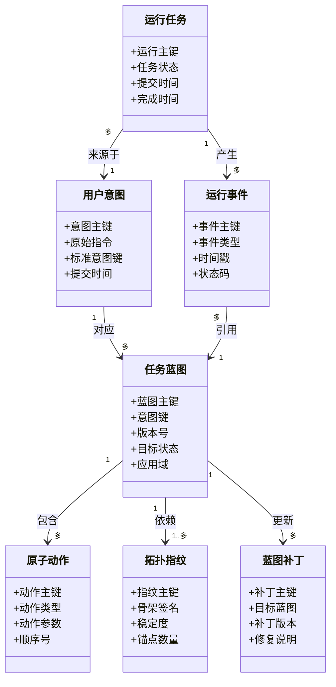

### 3.3 Mermaid E-R 简化版

说明：
- 如果 draw.io 对 `classDiagram` 字段渲染不好，可以退回这版
- 这版更简洁，但字段表现力弱

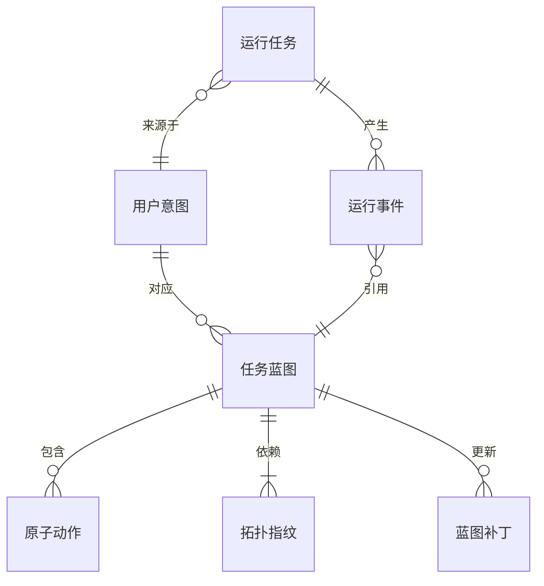

### 3.4 draw.io 兼容版 flowchart

说明：
- 如果你想要最稳的导入效果，建议用这一版
- 每个实体用一个字段盒子表示，适合后期手工微调

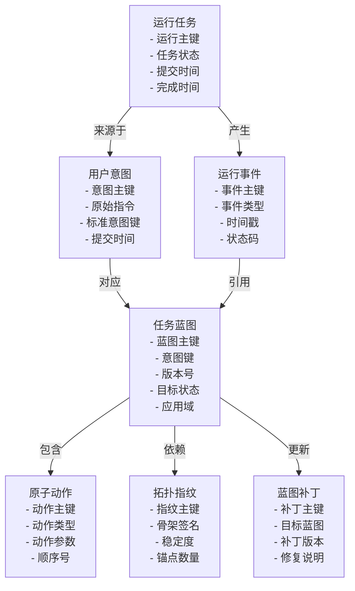

## 4. 图5-3 闭环校验与异常自愈流程图

### 4.1 推荐用途

- 第 5.3.2 节正文插图
- 用来说明执行闭环的核心控制机制

### 4.2 Mermaid 标准版

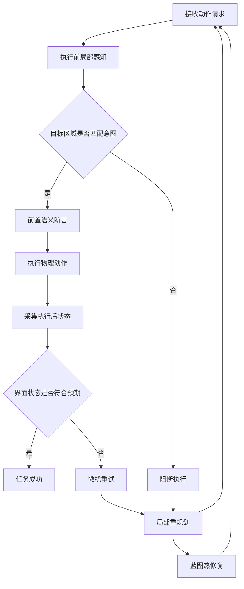

### 4.3 draw.io 强化版

说明：
- 这一版把“正常路径”和“异常路径”分左右展开，导入后更容易排版

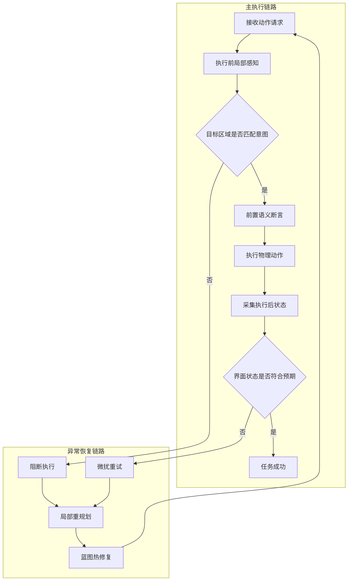

## 5. 图5-4 认知回灌与蓝图热修复流程图

### 5.1 推荐用途

- 第 5.4.1 节正文插图
- 用来说明“成功轨迹 -> 差分 -> 补丁 -> 更新 -> 下次命中”的闭环

### 5.2 Mermaid 环形逻辑版

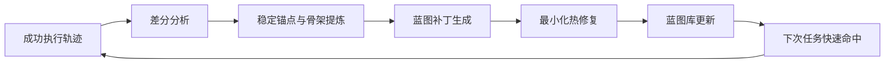

### 5.3 Mermaid 分层版

说明：
- 这版更适合 draw.io
- 环状结构在部分工具里对齐不稳定，分层版更容易后期微调

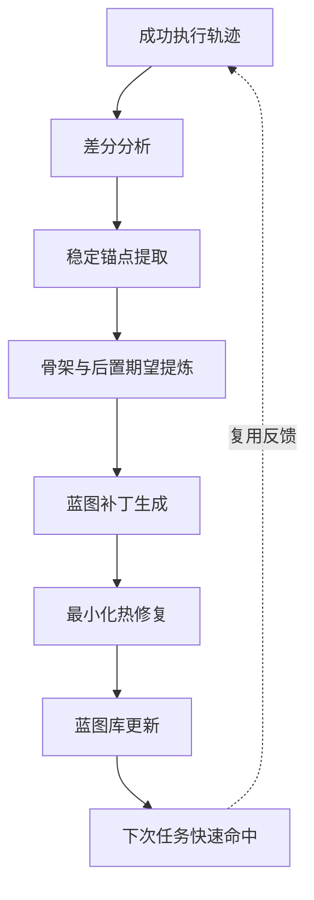

### 5.4 draw.io 强化版

说明：
- 适合手工加图标
- 可以给 `A` 加勾选文档图标，给 `G` 加数据库图标，给 `E/F` 加补丁图标

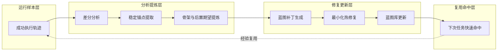

## 6. 使用顺序建议

如果你现在准备真正绘图，建议按这个顺序来：

1. `图4-3`
- 最清晰，最容易先落地

2. `图5-3`
- 流程闭环很关键，答辩时也容易讲

3. `图5-4`
- 可和第 5 章创新点对应

4. `图4-4`
- 最后画，因为逻辑数据模型最容易反复改

## 7. 额外说明

### 7.1 哪张最适合 Mermaid 直接用

1. 图4-3
2. 图5-3
3. 图5-4

### 7.2 哪张最适合 draw.io 手工精修

1. 图4-4

### 7.3 如果你要更正式

最终论文里的版本建议这样处理：

1. 先用 Mermaid 出结构草稿
2. 再在 draw.io 中统一：
- 字号
- 线宽
- 圆角半径
- 颜色
- 对齐
- 箭头样式

这样最后的图会比纯 AI 生图更稳，也更像软件工程论文。
