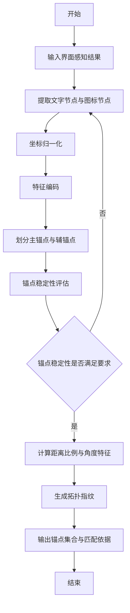
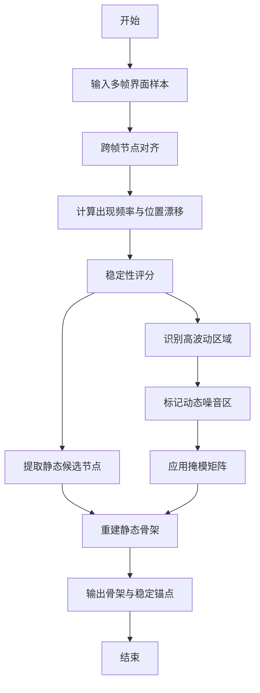
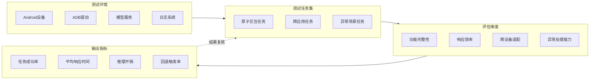
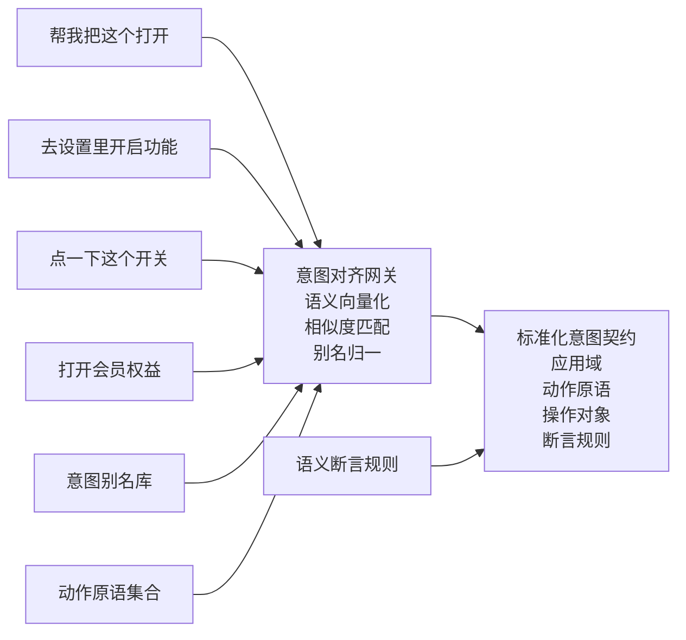
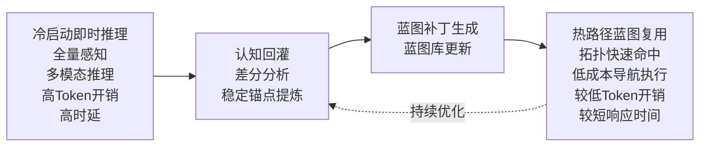

# 论文重点图表补完包 v1

## 1. 文档目的

本文档专门汇总当前论文最优先补完的 8 项图表内容，统一说明：

1. 该图/表放在哪里
2. 该图/表要表达什么
3. 推荐采用什么生成方式
4. 具体应包含哪些内容
5. 可直接使用的 Prompt、Mermaid 代码或表格模板

覆盖对象如下：

1. 图5-1 稀疏特征拓扑锚点识别流程图
2. 图5-2 动态场景去噪与静态骨架提取流程图
3. 表4-1 核心逻辑数据结构设计表
4. 图6-1 测试框架与验证闭环图
5. 表6-3 跨机型测试结果表
6. 表6-4 异常场景测试结果表
7. 图5-Y 自然语言指令到标准化意图契约的收敛示意图
8. 图5-Z 从即时推理到蓝图复用的成本迁移示意图

## 2. 优先补完总建议

### 2.1 建议顺序

1. 表4-1
2. 图5-1
3. 图5-2
4. 图6-1
5. 表6-3
6. 表6-4
7. 图5-Y
8. 图5-Z

### 2.2 原因

1. `表4-1` 是最典型的软件工程工作量证明
2. `图5-1` 与 `图5-2` 直接补强算法实现部分
3. `图6-1` 与第 6 章新增测试表共同补强“测试章证据感”
4. `图5-Y` 与 `图5-Z` 补的是创新表达与机制解释力

## 3. 图5-1 稀疏特征拓扑锚点识别流程图

### 3.1 放置位置

- 第 5.1.1 节后

### 3.2 图义目标

说明“界面感知结果如何被处理成可用于匹配的拓扑指纹”。

读者应该从这张图中看懂 4 件事：

1. 输入是什么
2. 主锚点和辅锚点如何划分
3. 稳定性如何判断
4. 输出为什么是拓扑指纹而不是普通截图特征

### 3.3 推荐生成方式

1. `AI 生图`
- 用于快速生成干净的算法流程草图
2. `draw.io 手工精修`
- 最终导出论文图

### 3.4 图中必须出现的节点

1. 开始
2. 输入界面感知结果
3. 提取文字节点与图标节点
4. 坐标归一化
5. 特征编码
6. 划分主锚点与辅锚点
7. 锚点稳定性评估
8. 计算距离比例与角度特征
9. 生成拓扑指纹
10. 输出锚点集合与匹配依据
11. 结束

判断节点：

1. 锚点稳定性是否满足要求

### 3.5 AI Prompt

```text
[Style & Meta-Instructions]
Academic algorithm flowchart for software engineering thesis, white background, clean 2D vector style, all visible labels in Chinese only.

[Layout Configuration]
Selected Layout: top-down algorithm flowchart
Composition Logic: one vertical main path, one decision diamond in the middle, one loop-back path on the left side

[Flow Nodes]
"开始"
"输入界面感知结果"
"提取文字节点与图标节点"
"坐标归一化"
"特征编码"
"划分主锚点与辅锚点"
"锚点稳定性评估"
"计算距离比例与角度特征"
"生成拓扑指纹"
"输出锚点集合与匹配依据"
"结束"

[Decision Node]
"锚点稳定性是否满足要求"

[Logic]
开始 -> 输入界面感知结果 -> 提取文字节点与图标节点 -> 坐标归一化 -> 特征编码 -> 划分主锚点与辅锚点 -> 锚点稳定性评估 -> 判断
If yes -> 计算距离比例与角度特征 -> 生成拓扑指纹 -> 输出锚点集合与匹配依据 -> 结束
If no -> 返回“提取文字节点与图标节点”

[Visual Rules]
Gray rounded rectangles for process blocks
Orange diamond for the decision node
Blue arrows for normal path
Orange loop-back arrow for retry path
All labels in Chinese only
```

### 3.6 Mermaid 草稿



## 4. 图5-2 动态场景去噪与静态骨架提取流程图

### 4.1 放置位置

- 第 5.1.2 节后

### 4.2 图义目标

说明系统如何通过多帧采样，把动态页面中的干扰区域剥离出去，保留静态骨架。

这张图的核心不是“分类页面元素”，而是“在时间维度上做信号分层”。

### 4.3 推荐生成方式

1. `AI 生图`
2. `draw.io 手工精修`

### 4.4 图中必须出现的节点

主链路：

1. 开始
2. 输入多帧界面样本
3. 跨帧节点对齐
4. 计算出现频率与位置漂移
5. 稳定性评分
6. 提取静态候选节点
7. 重建静态骨架
8. 输出骨架与稳定锚点
9. 结束

支链：

1. 识别高波动区域
2. 标记动态噪音区
3. 应用掩模矩阵

### 4.5 AI Prompt

```text
[Style & Meta-Instructions]
Academic algorithm flowchart, undergraduate thesis style, clean white background, strict 2D vector design, all labels in Chinese only.

[Layout Configuration]
Selected Layout: top-down processing pipeline with side branch
Composition Logic: a vertical main flow for static feature extraction and a right-side branch for dynamic noise suppression

[Main Flow]
"开始"
"输入多帧界面样本"
"跨帧节点对齐"
"计算出现频率与位置漂移"
"稳定性评分"
"提取静态候选节点"
"重建静态骨架"
"输出骨架与稳定锚点"
"结束"

[Side Branch]
"识别高波动区域"
"标记动态噪音区"
"应用掩模矩阵"

[Logic]
Main path goes from top to bottom
After "稳定性评分", split into:
Path A -> "提取静态候选节点"
Path B -> "识别高波动区域" -> "标记动态噪音区" -> "应用掩模矩阵"
Then merge into "重建静态骨架"

[Visual Rules]
Blue-gray main path
Orange side branch for dynamic suppression
Green final output block
All labels in Chinese only
```

### 4.6 Mermaid 草稿



## 5. 表4-1 核心逻辑数据结构设计表

### 5.1 放置位置

- 第 4.4 节

### 5.2 作用

这是最重要的“传统软件工程评审友好型”表格之一。  
必须让评审看到：

1. 你不是只写了概念
2. 你对系统里的核心数据对象有明确设计

### 5.3 推荐生成方式

直接手工制表，不建议生图。

### 5.4 推荐表头

| 实体名称 | 核心字段 | 数据类型 | 主外键关系 | 作用说明 |
|---|---|---|---|---|

### 5.5 可直接使用的表格内容

| 实体名称 | 核心字段 | 数据类型 | 主外键关系 | 作用说明 |
|---|---|---|---|---|
| 用户意图 | 意图主键、原始指令、标准意图键、提交时间 | 字符串、文本、字符串、时间戳 | 主键：意图主键 | 记录用户输入任务及其标准化映射结果 |
| 任务蓝图 | 蓝图主键、意图键、版本号、目标状态、应用域 | 字符串、字符串、整数、字符串、字符串 | 主键：蓝图主键；外键：意图键 -> 用户意图 | 记录结构化任务路径与目标状态描述 |
| 拓扑指纹 | 指纹主键、蓝图主键、骨架签名、稳定度、锚点数量 | 字符串、字符串、文本、浮点、整数 | 主键：指纹主键；外键：蓝图主键 -> 任务蓝图 | 描述页面静态骨架与拓扑匹配依据 |
| 原子动作 | 动作主键、蓝图主键、动作类型、动作参数、顺序号 | 字符串、字符串、字符串、文本、整数 | 主键：动作主键；外键：蓝图主键 -> 任务蓝图 | 记录蓝图中的基础执行动作 |
| 运行任务 | 运行主键、意图主键、任务状态、提交时间、完成时间 | 字符串、字符串、字符串、时间戳、时间戳 | 主键：运行主键；外键：意图主键 -> 用户意图 | 记录任务运行实例与生命周期状态 |
| 运行事件 | 事件主键、运行主键、事件类型、时间戳、状态码 | 字符串、字符串、字符串、时间戳、字符串 | 主键：事件主键；外键：运行主键 -> 运行任务 | 记录执行过程中的关键事件与日志片段 |
| 蓝图补丁 | 补丁主键、目标蓝图、补丁版本、修复说明 | 字符串、字符串、整数、文本 | 主键：补丁主键；外键：目标蓝图 -> 任务蓝图 | 记录蓝图热修复与经验回灌结果 |

## 6. 图6-1 测试框架与验证闭环图

### 6.1 放置位置

- 第 6.1 节后

### 6.2 图义目标

说明第 6 章不是随意做了几个测试，而是有：

1. 测试环境
2. 测试任务集
3. 评估维度
4. 输出指标
5. 结果复核

### 6.3 推荐生成方式

1. `AI 生图`
2. `draw.io 精修`

### 6.4 图中必须出现的区域

1. 测试环境
- Android设备
- ADB驱动
- 模型服务
- 日志系统

2. 测试任务集
- 原子交互任务
- 跨应用任务
- 异常场景任务

3. 评估维度
- 功能完整性
- 响应效率
- 跨设备适配
- 异常处理能力

4. 输出指标
- 任务成功率
- 平均响应时间
- 推理开销
- 回退触发率

### 6.5 AI Prompt

```text
[Style & Meta-Instructions]
Academic software testing framework diagram, thesis-ready vector style, white background, all visible labels in Chinese only.

[Layout Configuration]
Selected Layout: left-to-right layered evaluation framework
Composition Logic: test environment on the left, task set in the middle, evaluation dimensions on the right, output metrics on the far right, with one small feedback arrow for result review

[Zones]
Zone 1: "测试环境", "Android设备", "ADB驱动", "模型服务", "日志系统"
Zone 2: "测试任务集", "原子交互任务", "跨应用任务", "异常场景任务"
Zone 3: "评估维度", "功能完整性", "响应效率", "跨设备适配", "异常处理能力"
Zone 4: "输出指标", "任务成功率", "平均响应时间", "推理开销", "回退触发率"

[Connections]
测试环境 -> 测试任务集 -> 评估维度 -> 输出指标
Add one feedback arrow from 输出指标 back to 测试任务集 labeled "结果复核"

[Visual Rules]
Blue-gray for environment
Teal for task set
Orange for evaluation
Green for output metrics
Chinese labels only
```

### 6.6 Mermaid 草稿



## 7. 表6-3 跨机型测试结果表

### 7.1 放置位置

- 第 6.3.2 节

### 7.2 作用

当前正文里“跨机型适配成功率测试”只有文字，没有结构化证据。  
这张表可以直接把“真的测过不同设备”这件事立住。

### 7.3 推荐表头

| 设备类型 | 分辨率/比例 | 测试任务 | 执行结果 | 触控偏移表现 | 备注 |
|---|---|---|---|---|---|

### 7.4 可直接使用的表格内容

| 设备类型 | 分辨率/比例 | 测试任务 | 执行结果 | 触控偏移表现 | 备注 |
|---|---|---|---|---|---|
| 标准安卓手机 | 1080×2400，20:9 | 通信业务设置 | 成功 | 偏移较小，可完成目标点击 | 标准直屏 |
| 高分辨率手机 | 1440×3200，20:9 | 会员权益领取 | 成功 | 偏移可控，未影响流程闭环 | 2K 屏幕 |
| 小尺寸设备 | 1080×2160，18:9 | 订单查询转发 | 成功 | 局部偏移略增，但校验后可继续执行 | 有限显示区域 |
| 折叠屏设备 | 动态分辨率 | 跨应用跳转任务 | 基本成功 | 布局变化较大，需依赖拓扑匹配与重定位 | 异构布局 |

### 7.5 使用建议

如果你后续还有更多实测数据，可以把“成功/基本成功”换成更严谨的：

1. 成功
2. 部分成功
3. 失败

## 8. 表6-4 异常场景测试结果表

### 8.1 放置位置

- 第 6.4 节

### 8.2 作用

这张表能让“异常处理与自愈能力测试”从抽象叙述变成结构化测试结果。

### 8.3 推荐表头

| 异常类型 | 触发方式 | 检测机制 | 恢复策略 | 处理结果 | 备注 |
|---|---|---|---|---|---|

### 8.4 可直接使用的表格内容

| 异常类型 | 触发方式 | 检测机制 | 恢复策略 | 处理结果 | 备注 |
|---|---|---|---|---|---|
| 突发广告弹窗 | 任务执行前弹出营销窗口 | 前置语义断言 | 阻断执行并局部重规划 | 成功恢复 | 避免误触 |
| 页面加载超时 | 网络波动导致目标页面未完成加载 | 后置状态校验 | 等待后重试或触发重规划 | 基本恢复 | 时延增加 |
| 布局局部微调 | 应用更新导致按钮位置轻微变化 | 拓扑匹配偏移检测 | 仿射重定位 + 微扰重试 | 成功恢复 | 蓝图无需全量重建 |
| 控件响应失效 | 点击后界面无状态变化 | 后置校验失败 | 微扰重试 | 部分恢复 | 多次失败时回退 |
| 蓝图局部失配 | 旧蓝图与新页面结构不完全一致 | 拓扑一致性与状态偏离检测 | 蓝图热修复 | 成功恢复 | 形成补丁 |

## 9. 图5-Y 自然语言指令到标准化意图契约的收敛示意图

### 9.1 放置位置

- 建议新增到第 5.2.1 节后

### 9.2 作用

这是 5.2 中最值得补的一张机制图。  
它解决的问题是：

1. 读者不明白自然语言为什么能稳定转成统一指令
2. 读者不清楚意图对齐网关的作用

### 9.3 图义目标

左侧展示多种自然语言表达，  
中间展示意图对齐网关，  
右侧展示标准化意图契约，  
底部展示支持它的别名库、动作原语和断言规则。

### 9.4 推荐生成方式

1. `AI 生图`
2. `draw.io 精修`

### 9.5 AI Prompt

```text
[Style & Meta-Instructions]
Academic mechanism diagram for software engineering thesis, clean white background, strict 2D vector style, all visible labels in Chinese only.

[Layout Configuration]
Selected Layout: left-to-right convergence mechanism diagram
Composition Logic: multiple natural language expressions on the left converge into a central alignment gateway, then map to one standardized intent contract on the right, with support modules at the bottom

[Left Zone]
Several speech or document bubbles with different Chinese user expressions:
"帮我把这个打开"
"去设置里开启功能"
"点一下这个开关"
"打开会员权益"

[Center Zone]
One larger processing module:
"意图对齐网关"
Inside or below it show:
"语义向量化"
"相似度匹配"
"别名归一"

[Right Zone]
One standardized contract object:
"标准化意图契约"
Example fields shown in Chinese:
"应用域"
"动作原语"
"操作对象"
"断言规则"

[Bottom Support Zone]
"意图别名库"
"动作原语集合"
"语义断言规则"

[Arrow Rules]
Many-to-one arrows from left zone to center
One strong arrow from center to right
Thin support arrows from bottom modules to center and right

[Visual Rules]
Blue-gray for input expressions
Teal for alignment gateway
Orange for standardized contract
Green or gray for support modules
Chinese labels only
```

### 9.6 Mermaid 草稿



## 10. 图5-Z 从即时推理到蓝图复用的成本迁移示意图

### 10.1 放置位置

- 建议新增到第 5.4.1 节后

### 10.2 作用

这是 5.4 中最值得补的一张机制图。  
它直接把“认知回灌为什么有价值”可视化：

1. 冷启动为什么慢
2. 回灌中间做了什么
3. 热路径为什么更快更省

### 10.3 图义目标

左侧：高成本即时推理  
中间：差分提炼、补丁生成、蓝图库更新  
右侧：低成本蓝图命中与快速执行

### 10.4 推荐生成方式

1. `AI 生图`
2. `draw.io 精修`

### 10.5 AI Prompt

```text
[Style & Meta-Instructions]
Academic mechanism diagram for software engineering thesis, clean white background, strict 2D vector style, all visible labels in Chinese only.

[Layout Configuration]
Selected Layout: left-to-right cost migration mechanism diagram
Composition Logic: expensive reasoning path on the left, knowledge compilation and patching in the center, efficient blueprint reuse on the right

[Left Zone]
"冷启动即时推理"
Sub labels:
"全量感知"
"多模态推理"
"高Token开销"
"高时延"

[Center Zone]
"认知回灌"
"差分分析"
"稳定锚点提炼"
"蓝图补丁生成"
"蓝图库更新"

[Right Zone]
"热路径蓝图复用"
Sub labels:
"拓扑快速命中"
"低成本导航执行"
"较低Token开销"
"较短响应时间"

[Arrow Rules]
Strong left-to-right arrows
Optional small loop arrow from right back to center labeled "持续优化"

[Visual Rules]
Left zone in warm orange/red tones to imply higher cost
Center zone in teal/blue
Right zone in green/blue to imply lower cost and reuse
No decorative clutter
Chinese labels only
```

### 10.6 Mermaid 草稿



## 11. 最后建议

### 11.1 如果你现在只想做最值的 4 项

优先做：

1. 表4-1
2. 图5-1
3. 图5-2
4. 图6-1

### 11.2 如果你想把论文“解释力”明显抬升

在上面 4 项完成后，优先再补：

1. 图5-Y
2. 图5-Z

因为它们会显著改善第 5 章读起来“抽象但难懂”的问题。
