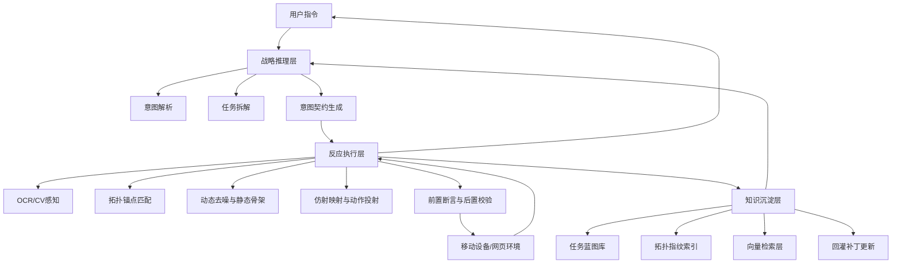
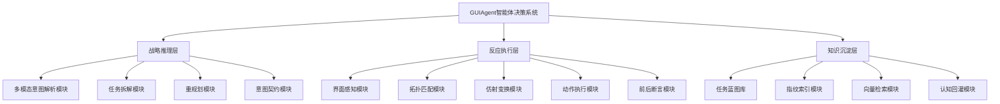
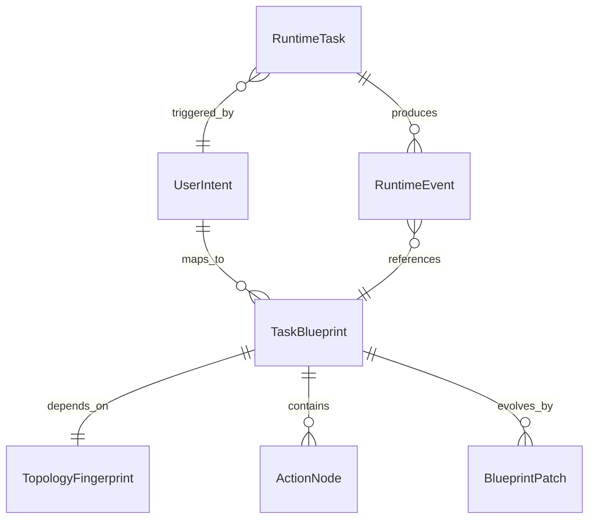
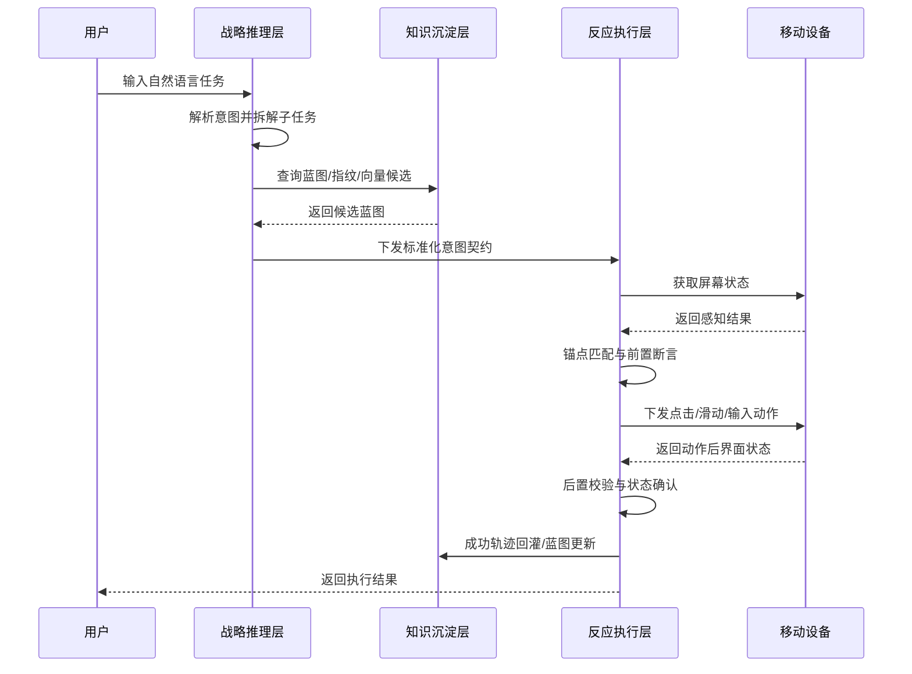

# 论文软件工程视角补强方案 v1

## 1. 文档目标

本文档面向传统本科软件工程 / 计算机专业评审视角，补足论文当前偏“概念与架构叙述”、但相对缺少“软件工程图表与结构化设计表达”的问题。

补强原则：

1. 以 `GUIAgent` 目标系统为主体。
2. 以当前代码设计为主要依据。
3. 允许加入已经纳入主线、短期确定会实现的合理设计。
4. 不引入明显超出蓝图边界的分布式群智实现细节。

## 2. 评审最可能关注但当前论文偏弱的点

从传统评审视角看，当前论文最容易被追问的是：

1. 系统是否真的有“完整软件结构”，还是只有概念叙述。
2. 数据到底如何存，实体之间如何关联。
3. 一次任务执行时，模块之间如何交互。
4. 蓝图、锚点、动作、事件这些核心对象之间有什么关系。
5. 系统如何从用户输入流转到底层执行，再回流到知识库。
6. 第 4 章是否有足够“门面级图表”，支撑第 5 章实现工作量。

因此，论文建议额外补齐以下内容：

- 总体架构图
- 功能模块划分图
- 逻辑数据模型 / E-R 图
- 核心数据表设计
- 关键任务时序图
- 核心数据流图
- 核心算法流程图

## 3. 建议新增的图表清单

### 3.1 系统总体架构图

建议插入位置：

- 第 4 章 `4.1 总体架构设计原则` 后
- 或 `4.2 功能模块划分与协作逻辑` 前

推荐用途：

- 让评审在 10 秒内理解系统层次
- 将“战略推理层 / 反应执行层 / 知识沉淀层”从文字变成结构图

建议图形层次：

1. 交互层
- 用户自然语言输入
- 任务结果反馈

2. 战略推理层
- 多模态意图解析
- 任务拆解与局部重规划
- 标准化意图契约生成

3. 反应执行层
- OCR / CV 感知
- 锚点拓扑匹配
- 静态骨架与动态去噪
- 仿射投影
- 前置断言 / 后置校验
- ADB / 移动执行桥接

4. 知识沉淀层
- 蓝图库
- 拓扑指纹索引
- 向量检索层
- 回灌与补丁更新

5. 基础环境层
- Android OS
- ADB Protocol
- LLM / VLM API
- 本地存储与日志

可直接作为论文草图的 Mermaid：

### 3.2 功能模块划分图

建议插入位置：

- 第 4 章 `4.2 功能模块划分与协作逻辑`

推荐用途：

- 体现系统模块化设计
- 直接对应第 5 章“实现工作量”

建议按树状分层：

### 3.3 逻辑数据模型 / E-R 图

建议插入位置：

- 第 4 章 `4.4 数据库与知识库逻辑结构设计` 开头

推荐用途：

- 满足传统评审对“数据库设计”的预期
- 证明系统不是只有算法，还有清晰的数据组织方式

注意：

- 即便底层部分数据存于 JSON、向量索引或事件日志，也可以先抽象为逻辑实体模型
- 论文里重点讲“逻辑实体关系”，不必拘泥于底层一定是关系数据库

建议核心实体：

1. `UserIntent`
- 用户原始意图及标准化意图键

2. `TaskBlueprint`
- 任务蓝图主实体

3. `TopologyFingerprint`
- 页面拓扑指纹/静态骨架

4. `ActionNode`
- 蓝图中的原子动作节点

5. `RuntimeTask`
- 一次任务运行实例

6. `RuntimeEvent`
- 运行时过程事件

7. `BlueprintPatch`
- 蓝图热修复补丁

建议关系：

- 一个 `UserIntent` 可对应多个 `TaskBlueprint`
- 一个 `TaskBlueprint` 依赖一个主要 `TopologyFingerprint`
- 一个 `TaskBlueprint` 包含多个 `ActionNode`
- 一个 `RuntimeTask` 在执行过程中产生多个 `RuntimeEvent`
- 一个 `TaskBlueprint` 可以关联多个 `BlueprintPatch`

Mermaid 草图：

### 3.4 核心任务时序图

建议插入位置：

- 第 4 章 `4.3 决策流程建模与意图契约设计`

推荐用途：

- 展示“用户 -> 规划 -> 检索 -> 执行 -> 校验 -> 回灌”的动态流程
- 这是评审最容易理解“闭环”的图

建议参与者：

- 用户
- 战略推理层
- 知识沉淀层
- 反应执行层
- 移动设备

Mermaid 草图：

### 3.5 数据流图

建议插入位置：

- 第 4 章末尾或第 5 章前

推荐用途：

- 区分“控制流”和“数据流”
- 让评审看清楚哪些数据在系统里流转

建议重点体现的数据对象：

- 用户指令
- 意图契约
- 感知结果
- 锚点集合
- 骨架指纹
- 动作请求
- 执行事件
- 蓝图补丁

Mermaid 草图：

### 3.6 核心算法流程图

建议插入位置：

- 第 5 章各子节中

建议至少补两张：

1. `5.1.1` 稀疏特征拓扑锚点识别流程图
2. `5.3.2` 闭环校验与异常自愈流程图

这两张最能体现“工程实现深度”。

## 4. 传统“数据库设计”该怎么写

这是最容易被追问的点。

### 4.1 不必拘泥于关系数据库

你的系统不是传统 MIS 管理系统，不需要伪造一套 MySQL 驱动的业务库。

更合理的写法是：

- 采用“逻辑数据模型 + 物理存储分层”的描述方式
- 逻辑层用传统实体关系讲清楚
- 物理层说明：
  - 蓝图主记录可存储为 JSON 文档
  - 指纹索引可存于向量化检索结构
  - 运行过程存于事件日志

这样既符合传统评审习惯，也不违背系统真实技术路线。

### 4.2 建议在论文里加入“逻辑表结构设计”

建议至少列 4 张核心逻辑表：

#### 4.2.1 用户意图表 `user_intent`

| 字段名 | 类型 | 键 | 说明 |
| --- | --- | --- | --- |
| intent_id | varchar | PK | 意图主键 |
| raw_instruction | text |  | 用户原始输入 |
| intent_key | varchar |  | 标准化意图键 |
| domain | varchar |  | 应用域 |
| verb | varchar |  | 动作原语 |
| object_name | varchar |  | 操作对象 |
| created_at | datetime |  | 创建时间 |

#### 4.2.2 任务蓝图表 `task_blueprint`

逻辑上可由 [patch_model.py](/mnt/d/ProjectSpace/Uni-Mind/guiagent_v2/blueprint_hub/patch_model.py) 中的 `Blueprint` 抽象而来。

| 字段名 | 类型 | 键 | 说明 |
| --- | --- | --- | --- |
| blueprint_id | varchar | PK | 蓝图主键 |
| intent_key | varchar | FK | 关联标准意图 |
| app_state | varchar |  | 页面状态标识 |
| version | varchar |  | 蓝图版本 |
| ref_width | int |  | 参考屏幕宽度 |
| ref_height | int |  | 参考屏幕高度 |
| anchors_json | json |  | 锚点集合 |
| post_expectations_json | json |  | 后置期望 |
| metadata_json | json |  | 蓝图元数据 |

#### 4.2.3 拓扑指纹表 `topology_fingerprint`

可由静态骨架、签名、动态槽位抽象而来。

| 字段名 | 类型 | 键 | 说明 |
| --- | --- | --- | --- |
| fingerprint_id | varchar | PK | 指纹主键 |
| blueprint_id | varchar | FK | 所属蓝图 |
| signature | varchar |  | 骨架签名 |
| stable_ratio | float |  | 稳定度 |
| frame_count | int |  | 采样帧数 |
| node_count | int |  | 骨架节点数 |
| dynamic_slots_json | json |  | 动态槽位 |

#### 4.2.4 原子动作表 `action_node`

| 字段名 | 类型 | 键 | 说明 |
| --- | --- | --- | --- |
| action_id | varchar | PK | 动作节点主键 |
| blueprint_id | varchar | FK | 所属蓝图 |
| step_no | int |  | 动作顺序号 |
| action_type | varchar |  | 点击/滑动/输入等 |
| action_params_json | json |  | 动作参数 |
| pre_assertion_json | json |  | 前置断言 |
| post_check_json | json |  | 后置校验 |

#### 4.2.5 运行任务表 `runtime_task`

可由 [task_service.py](/mnt/d/ProjectSpace/Uni-Mind/guiagent_v2/runtime/task_service.py) 中的任务记录抽象而来。

| 字段名 | 类型 | 键 | 说明 |
| --- | --- | --- | --- |
| run_id | varchar | PK | 运行实例标识 |
| task_id | varchar |  | 任务标识 |
| request_id | varchar |  | 请求标识 |
| instruction | text |  | 用户指令 |
| runtime_mode | varchar |  | 运行模式 |
| status | varchar |  | 执行状态 |
| submitted_at | datetime |  | 提交时间 |
| started_at | datetime |  | 开始时间 |
| completed_at | datetime |  | 结束时间 |

#### 4.2.6 运行事件表 `runtime_event`

可由 [event_schema.py](/mnt/d/ProjectSpace/Uni-Mind/guiagent_v2/runtime/event_schema.py) 中的统一事件结构抽象而来。

| 字段名 | 类型 | 键 | 说明 |
| --- | --- | --- | --- |
| event_id | varchar | PK | 事件主键 |
| run_id | varchar | FK | 所属运行实例 |
| task_id | varchar | FK | 所属任务 |
| step_id | int |  | 步骤号 |
| event_type | varchar |  | 事件类型 |
| status | varchar |  | 事件状态 |
| intent_key | varchar |  | 关联意图键 |
| payload_json | json |  | 扩展载荷 |
| ts | datetime |  | 事件时间 |

### 4.3 论文中要强调“逻辑模型”和“物理实现”分离

推荐你在 4.4 节加入一句：

“为兼容传统软件工程中的数据库设计描述方式，本文首先从逻辑层面对系统核心数据实体进行建模；在物理实现层面，则根据数据结构特点分别采用 JSON 文档存储、事件日志存储与向量化索引机制承载不同类型的数据。”

这句话很关键，能化解评审看到“不是传统表结构”时的疑虑。

## 5. 建议重点补充的“流程与时序”

### 5.1 建议重点展示一条“快路径”

即：

- 用户下达指令
- 战略推理层生成意图契约
- 知识层命中蓝图
- 执行层完成匹配、投射、断言
- 成功返回

这是最能代表系统效率提升的主线。

### 5.2 再补一条“异常回退路径”

即：

- 前置断言失败
- 触发局部微扰 / 重试
- 后置校验失败
- 触发局部重规划
- 成功后回灌蓝图

评审会很喜欢这一条，因为它体现了“自愈”和“闭环”。

### 5.3 再补一条“回灌更新路径”

即：

- 高成本探索成功
- 轨迹差分
- 蓝图补丁生成
- 更新蓝图库
- 下次命中快路径

这条路径能把你的创新点讲透。

## 6. 论文里可以新增但不必过重展开的内容

### 6.1 系统状态机

建议在第 4 章或第 5 章补一个小图，说明执行状态：

- INIT
- ROUTED
- GUARDED
- EXECUTING
- VERIFYING
- COMPLETED / HANDOVER / FAILED

这能体现系统不是简单脚本，而是有明确运行状态控制。

### 6.2 控制面与日志系统

如果你希望论文更像“真实软件系统”，可以轻量补一句：

- 系统通过统一事件总线记录任务生命周期
- 支持任务状态查询、时间线追踪与运行审计

这类内容不必成为主创新点，但会增强工程感。

### 6.3 数据安全与治理

如果评审偏重工程规范，可在第 7 章补：

- 对隐私截图与日志进行脱敏
- 对蓝图补丁更新设置质量门禁
- 对模型输出采用结构化约束和断言校验

## 7. 最推荐补的 5 张图

如果你时间有限，优先补这 5 张：

1. 系统总体架构图
2. 功能模块划分图
3. 逻辑 E-R 图
4. 任务执行时序图
5. 异常回退与闭环校验流程图

这 5 张图能显著改变评审对论文“软件工程完成度”的印象。

## 8. 最推荐补的 3 张表

1. 核心逻辑数据结构表
- `user_intent`
- `task_blueprint`
- `topology_fingerprint`
- `action_node`

2. 运行过程数据表
- `runtime_task`
- `runtime_event`

3. 模块职责表
- 模块名
- 输入
- 输出
- 核心职责

## 9. 最终建议

这篇论文目前不缺“高层思想”，缺的是让传统评审快速确认“你确实做了一个复杂软件系统”的结构化证据。

因此，后续补强应优先服务三个目标：

1. 让架构可视化
2. 让数据结构可视化
3. 让任务执行闭环可视化

只要把这三件事补上，论文会从“高阶架构描述”转成“兼具研究深度与软件工程工作量证明的系统设计论文”。
